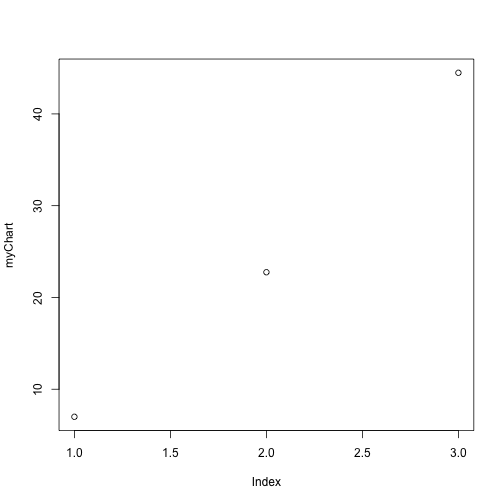

Shiny Start-Up Series A-D Valuation Calculator
========================================================
author: J. A. Marin (jam212310@gmail.com)
date: August 20, 2016
transition:  rotate

Factors Relevant to a Start-Up's Valuation
========================================================

- Founders' Past Experience and Integrity (Character)
- Revenue (Ratio of Revenue to Invested Capital)
- Zeitgeist Correlation (Trend Capture)
- Celebrity Appeal ("Shark Tank Effect")

Average Size of Series Round (Past 10 years)
========================================================


```r
myData =  read.csv('startup_data.csv')
myChart = c(mean(myData[,2]), mean(myData[,3]), mean(myData[,4]))
print("Series A, Series B, Series C (Average Size)")
```

```
[1] "Series A, Series B, Series C (Average Size)"
```

```
[1]  6.995455 22.750000 44.479545
```

Historical Series Valuations
========================================================

 

Example of Valuation Based on Factors 
===
Experience Vector * Revenue Ratio * Zeitgeist Capture * Celebrity Appeal

5 years * 0.20 Revenue Ratio * 5 Zeitgeist Units * 2 Celebrity Sponsors


```r
eval(5 * .20 * 5 * 2 * 100000)
```

```
[1] 1e+06
```
Thusly, $ 1 million, based upon our "back-of-the-R-envelope" appraisal.
